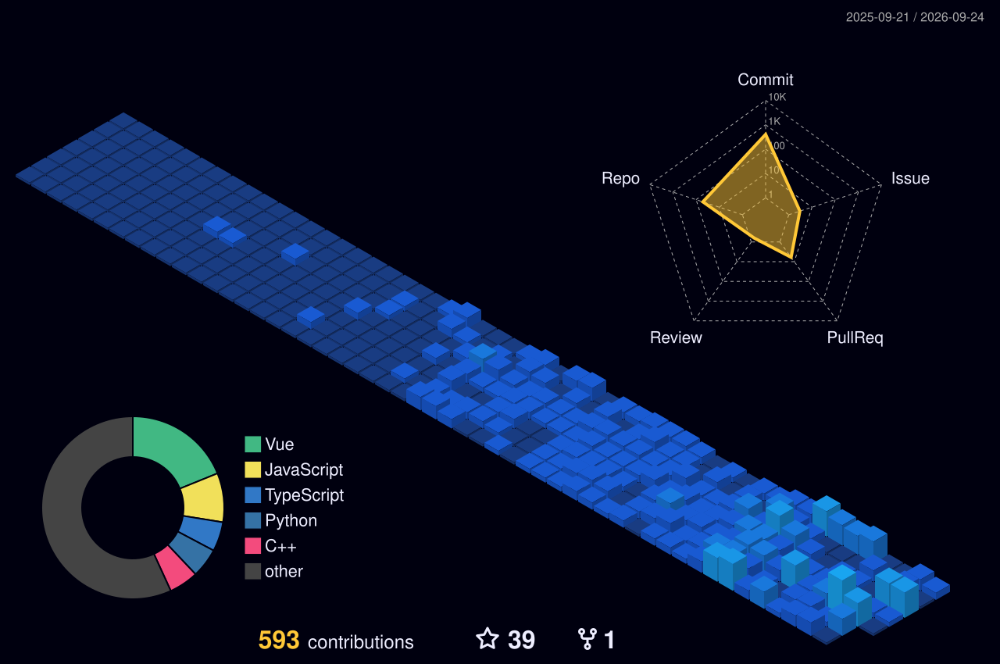

# Hi 👋, I'm Abidzar Dzakwan Sahudi

<p align="left">
  
</p>

### 🌐 Connect with Me
<p align="left">
<a href="https://www.linkedin.com/in/abidzar-dzakwan-sahudi-011593388/" target="blank"></a>
<a href="https://wa.me/6289601261250" target="blank"></a>
<a href="https://discordapp.com/users/YOUR_DISCORD_ID" target="blank"></a>
<a href="https://www.instagram.com/bizrrr_ae/" target="blank"></a>
<a href="mailto:abidzardzakwan36@gmail.com"></a>
</p>

### 👨‍💻 About Me
```javascript
const abidzarProfile = {
  status: "Informatics Student",
  focus: ["Full-Stack Engineering", "AI Integrations"],
  currentProjects: ["SantriConnect", "EVoting Apps", "Smart Retail App"
  background: "Blending Pesantren discipline with modern technology.",
  execute: () => console.log("Compiling the future, one line at a time. 🚀")
};
```
- 🎓 **Informatics Student** at **Universitas Muhammadiyah Surabaya**.
- 🏫 **Alumnus of SMK TI Annajiyah Bahrul Ulum Tambakberas Jombang**.
- 🚀 Interested in **Web & Android Development, Robotics, and AI**.
- ⚡ 3 years of experience living in **Pondok Pesantren** — blending discipline with technology.

---

### ⚡ Core Expertise
> "My primary tools for building robust and intelligent solutions."

<p align="left">
  
  
  
  
</p>

---

### 🛠️ Tech Stack & Tools

#### 💻 Programming Languages & OS
<p align="left">
<a href="https://docs.python.org/3/" target="_blank"></a>
<a href="https://developer.mozilla.org/en-US/docs/Web/JavaScript" target="_blank"></a>
<a href="https://www.php.net/docs.php" target="_blank"></a>
<a href="https://go.dev/doc/" target="_blank"></a>
<a href="https://en.cppreference.com/w/" target="_blank"></a>
<a href="https://kotlinlang.org/docs/home.html" target="_blank"></a>
<a href="https://www.microsoft.com/windows" target="_blank"></a>
<!-- <a href="https://ubuntu.com/tutorials" target="_blank"></a> -->
<!-- <a href="https://wiki.archlinux.org/" target="_blank"></a> -->
</p>

#### 🚀 Frameworks & Libraries
<p align="left">
<a href="https://laravel.com/docs" target="_blank"></a>
<a href="https://vuejs.org/guide/introduction.html" target="_blank"></a>
<a href="https://react.dev/" target="_blank"></a>
<a href="https://nextjs.org/docs" target="_blank"></a>
<a href="https://nuxt.com/docs">
  
</a><a href="https://expressjs.com/" target="_blank"></a>
<a href="https://gin-gonic.com/docs/" target="_blank"></a>
<a href="https://gorm.io/docs/" target="_blank"></a>
<a href="https://tailwindcss.com/docs" target="_blank"></a>
<a href="https://docs.flutter.dev/" target="_blank"></a>
<a href="https://www.tensorflow.org/api_docs" target="_blank"></a>
<a href="https://pytorch.org/docs/" target="_blank"></a>
<a href="https://docs.opencv.org/" target="_blank"></a>
<a href="https://redux.js.org/" target="_blank"></a>
<a href="https://pinia.vuejs.org/" target="_blank"></a>
</p>

#### ⚙️ IDEs & Development Tools
<p align="left">
<a href="https://www.jetbrains.com/webstorm/" target="_blank"></a>
<a href="https://www.jetbrains.com/phpstorm/" target="_blank"></a>
<a href="https://www.jetbrains.com/clion/" target="_blank"></a>
<a href="https://www.jetbrains.com/pycharm/" target="_blank"></a>
<a href="https://www.jetbrains.com/idea/" target="_blank"></a>
<a href="https://www.jetbrains.com/rider/" target="_blank"></a>
<a href="https://www.jetbrains.com/go/" target="_blank"></a>
<a href="https://www.jetbrains.com/rust/" target="_blank"></a>
<a href="https://developer.android.com/studio" target="_blank"></a>
<a href="https://nodejs.org/en/docs/" target="_blank"></a>
<a href="https://docs.docker.com/" target="_blank"></a>
<a href="https://www.postgresql.org/docs/" target="_blank"></a>
<a href="https://www.mongodb.com/docs/" target="_blank"></a>
<a href="https://vercel.com/docs" target="_blank"></a>
<a href="https://ngrok.com/docs" target="_blank"></a>
</p>

---

### 📊 GitHub Analysis & Activity

<div align="center">
<!-- <a href="https://wakatime.com/@BizrStillLearning" target="_blank">
  
</a> -->
  <p align="center">
    <a href="https://github.com/BizrStillLearning?tab=repositories" target="_blank"></a><a href="https://github.com/BizrStillLearning" target="_blank">     </a>
  </p>

  <p>
    <a href="https://github.com/BizrStillLearning?tab=repositories" target="_blank">
      
    </a>
    <a href="https://wakatime.com" target="_blank">
      
    </a>
  </p>

  <p>
    
  </p>
</div>

---

<!--
### 🐍 Contribution Snake
<p align="center">
  
</p>
-->

<div align="center">
  <h3>🏙️ Contribution Architecture</h3>
  
</div>

---

### 🧠 AI Learning Roadmap (2026 Target)
> "Transforming data into intelligence, step by step."

- [x] **Foundations:** Python for Data Science, Linear Algebra, and Calculus `(100%)`
- [x] **Machine Learning:** Regression, Clustering, and Scikit-Learn `(100%)`
- [x] **Hardware Integration:** AI models with Robotics & Arduino `(20%)`
- [x] **Deep Learning:** Neural Networks, CNNs with TensorFlow & PyTorch `(100%)`
- [x] **Computer Vision:** Advanced Image Processing with OpenCV `(65%)`
- [x] **Natural Language Processing (NLP):** LLM exploration `(70%)`

---

<div align="center">
   
  <br>
  
</div>

<div align="center">
  <table width="85%" border="0" cellspacing="0" cellpadding="0" style="border: none; border-collapse: collapse;">
    <tr style="border: none;">
      <td width="50%" align="center" valign="top" style="border: none;">
        <b>🎵 Recently Played on Spotify</b><br><br>
        <a href="https://spotify.com" target="_blank">
          
        </a>
      </td>
      <td width="50%" align="center" valign="top" style="border: none;">
        <b>Curated Favorites 💿</b><br><br>
        <table border="0" cellspacing="10" cellpadding="0" style="border: none;">
          <tr>
            <td align="center" style="border: none;">
              <a href="https://open.spotify.com/search/BABYMONSTER%20Drip" target="_blank">
                
              </a>
            </td>
            <td align="center" style="border: none;">
              <a href="https://open.spotify.com/search/aespa%20Armageddon" target="_blank">
                
              </a>
            </td>
          </tr>
          <tr>
            <td align="center" style="border: none;">
              <a href="https://open.spotify.com/search/NMIXX%20Heavy%20Serenade" target="_blank">
                
              </a>
            </td>
            <td align="center" style="border: none;">
              <a href="https://open.spotify.com/search/Aespa%20LEMONADE" target="_blank">
                
              </a>
            </td>
          </tr>
          <tr>
            <td align="center" style="border: none;">
              <a href="https://open.spotify.com/search/IVE%20REVIVE%2B" target="_blank">
                
              </a>
            </td>
            <td align="center" style="border: none;">
              <a href="https://open.spotify.com/search/aespa%20Drama" target="_blank">
                
              </a>
            </td>
          </tr>
        </table>
      </td>
    </tr>
  </table>
</div>

---

> *"Das Genie wohnt nur eine Etage hgher als der Wahnsinn."* — **Arthur Schopenhauer**

---
*Success is the result of preparation, hard work, and learning from failure.*
